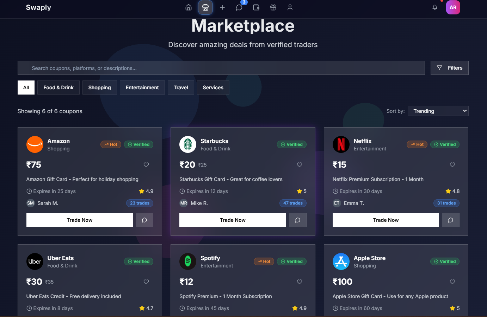
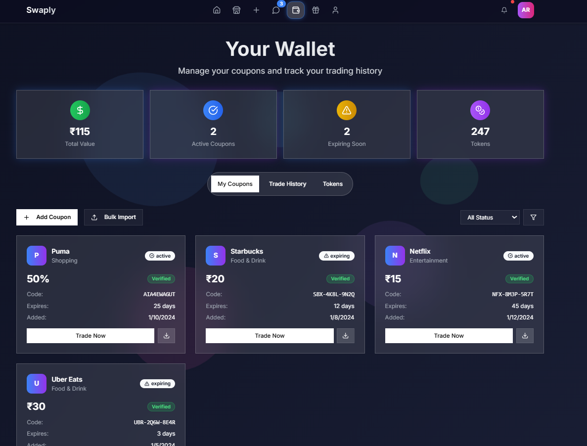

# Swaply — Trust-First Coupon Exchange Marketplace

🏆 3rd Place, GDG WoW 2025 Hackathon — National level, selected among 150 teams from 750+ participants.

A marketplace where users exchange unused coupons instead of letting them expire unused — designed around solving the **trust problem** in peer-to-peer coupon exchange: how do you know the coupon you're buying is real, unused, and not already claimed elsewhere?

## The Problem

Coupons expire unused every day — sitting in sinboxes, forgotten, wasted. A resale/exchange market exists, but it's broken by trust: no way to verify a coupon is genuine, unclaimed, and valid before the exchange happens. Swaply was built to solve that trust gap, not just to be another listings marketplace.

## System Design

**Core marketplace flow:**

- Users list unused coupons for exchange
- Search/match system surfaces relevant coupons to buyers by category, brand, and value
- If no exact match exists, the system can surface a sponsored alternative from a partner brand — e.g., a user searching for a Puma coupon with no match sees a promoted Nike coupon instead.
  This is also the monetization path: brands pay to be surfaced as the fallback recommendation.
  
- **Real-time negotiation via chat:** buyers and sellers negotiate trade terms directly in-app — proposing bundled offers (e.g., multiple lower-value coupons to match one higher-value coupon), with a live fairness score (e.g., "110%") calculated on each proposal so both sides can see at a glance whether an offer is under, over, or fairly valued before accepting
  
  **Trust & validation layer (designed, not fully implemented in the hackathon build):**
- OCR-based scanning to verify coupon authenticity at listing time, catching fake or already-used coupons before they reach the marketplace
- A live verification window at the point of exchange: buyer and seller confirm the coupon in a real-time session (~5 seconds) rather than trusting a static screenshot, closing the gap where a coupon could be resold or reused after the listing

**Why this design, not a simpler one:** the incident of large-scale coupon fraud around the same period (a well-known coupon exploitation controversy involving a major fast-food brand) validated exactly the problem Swaply targets — reinforcing that trust/fraud prevention, not just listings, is the actual hard problem in this space.

## What Was Actually Built (Hackathon Scope)

Being transparent about build vs. design, since the two aren't the same:

- **Built:** Frontend (React + Vite) — marketplace UI, listing flow, search/browse experience, and real-time chat-based negotiation with trade proposals and a live fairness score
- **Backend:** Minimal, built collaboratively as part of a team during the hackathon — core routing only, not production logic
- **Designed but not implemented:** OCR-based coupon validation, live verification window, sponsored-listing monetization engine

This was a 2-day hackathon build. The system design above reflects the full intended architecture; the working demo covered the frontend and core marketplace concept enough to win 3rd place on the strength of the idea and trust-focused framing.

## Tech Stack

**Frontend:** React, Vite
**Backend:** Node.js (minimal, team-built)

## What This Project Demonstrates

- Identifying and designing around a trust/fraud problem rather than just building a generic listings app
- Thinking through monetization as part of the system design, not an afterthought
- Scoping a hackathon build realistically — shipping a working frontend and a credible full-system design within a 2-day window
